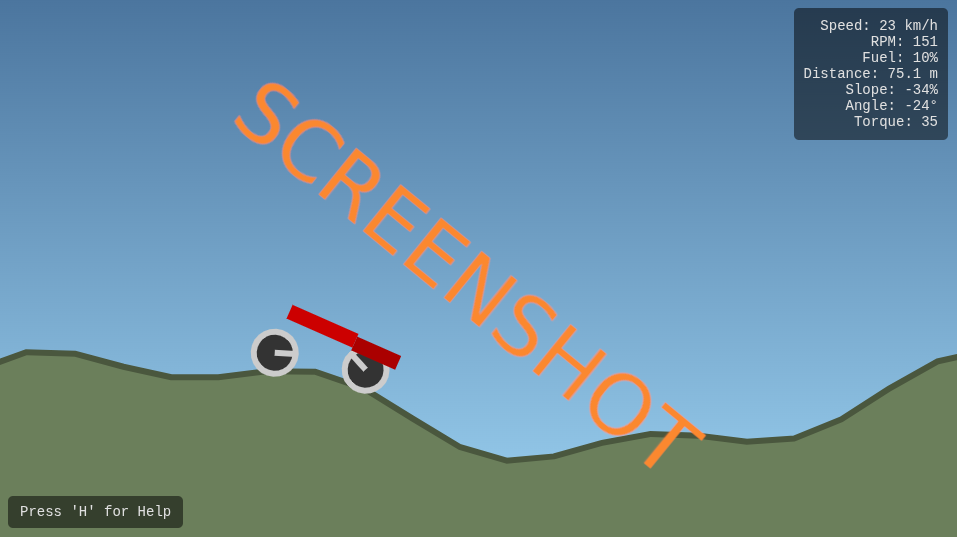

# js_climbhill

# 🚙 Planck Racer

A 2D side‑view hill‑climb / rally toy built on **HTML5 Canvas** + **Planck.js (Box2D for JS)**.  
Drive across a procedurally generated landscape with springy suspension, fuel pickups, checkpoints, and a lightweight HUD. Keyboard, gamepad, and mobile touch are supported.

> **Tech:** Vanilla JS, Canvas 2D, Planck.js physics at 120 Hz. No build step.

## Screenshots


---

## ✨ Features

- **Planck.js vehicle** with springy wheel joints, motor/brake torque, and in‑air pitch control
- **Procedural terrain** (sinusoidal blend) with slope limiting, culling & on‑the‑fly generation
- **HUD metrics:** Speed (km/h), RPM, Fuel %, Distance (m), Slope %, **Angle (°)** & **Applied Torque**
- **Checkpoints & fuel cans** — auto‑place on peaks; reset spawns slightly above ground to avoid jams
- **Game states:** Pause/Resume, Debug overlay, Game Over on fuel depletion
- **Gamepad support:** RT/LT throttle/brake, left stick pitch, Start/Pause
- **Mobile controls:** Large on‑screen tilt + gas/brake (auto‑visible on touch/smaller screens)
- **Particles & simple art pass** (sky gradient, ground fill below chain)
- **120 Hz physics** with fixed‑step accumulator and a max step clamp for stability

---

## 🎮 Controls

| Action | Keyboard | Gamepad | Mobile |
|---|---|---|---|
| Throttle | ↑ | RT (button 7) | **Gas** |
| Brake | ↓ | LT (button 6) | **Brake** |
| Pitch (air) | ← / → | Left stick (X) | ◄ / ► |
| Pause | Space | Start (button 9) | — |
| Reset to checkpoint | R | — | — |
| Toggle Help | H | — | — |
| Toggle Debug | D | — | — |

> Tip: In **Debug** mode, fuel is held at 100% for testing.

---

## 🗂 Project Structure

```
.
├─ index.html        # Canvas, HUD/overlays, CDN for Planck.js, favicon (🚙)
├─ style.css         # Dark theme, HUD panel, mobile controls
└─ script.js         # Physics world, vehicle, terrain, input, render loop
```

- **No bundler required.** Just open `index.html` in a modern browser.
- Planck.js is loaded via CDN:  
  `https://cdn.jsdelivr.net/npm/planck@latest/dist/planck.min.js`

> If you need **offline** development, download `planck.min.js` and serve via a local web server.

---

## 🚀 Run Locally

**Fastest:** double‑click `index.html` (works in most browsers).  
**Recommended (avoids CORS on some setups):**

```bash
# Python 3
python -m http.server 8000
# then open http://localhost:8000
```

---

## 🧪 Dev/Debug Shortcuts

- **H** — toggle Help panel
- **D** — toggle Debug visuals (joint anchors, step color, HUD tint)
- **Space** — pause/resume
- **R** — reset to last checkpoint (spawns a few wheel‑radii above ground)
- **Out of bounds** (y < -50) auto‑resets to keep you in play

---

## ⚙️ Key Constants (edit in `script.js`)

```js
// Simulation / timing
const PPM = 60;                 // Pixels per meter for Canvas scale
const PHYSICS_STEP = 1 / 120;   // Fixed 120 Hz physics
const MAX_ACCUMULATOR_STEPS = 5;

// Vehicle tuning
const VEHICLE_PARAMS = {
  CHASSIS_MASS: 180,
  REAR_BAR_DIM: { w: 1.2, h: 0.25 },
  FRONT_BAR_DIM: { w: 0.8, h: 0.25 },
  FRONT_BAR_OFFSET: { x: 0.8, y: -0.05 },
  WHEEL_MASS: 12,
  WHEEL_RADIUS: 0.35,
  WHEEL_FRICTION: 1.6,
  WHEEL_RESTITUTION: 0.05,
  TRACK_WIDTH: 1.5,
  SUSPENSION_FREQ_HZ: 2.0,
  SUSPENSION_DAMPING_RATIO: 0.45,
  SUSPENSION_TRAVEL: 0.35,
  MAX_SPRING_FORCE: 80000,
  MOTOR_TORQUE: 900,
  MOTOR_MAX_SPEED: 70,        // rad/s
  BRAKE_TORQUE: 1800,
  ENGINE_BRAKE_TORQUE: 70,
  AIR_CONTROL_TORQUE: 1800,
  AIR_CONTROL_DAMPING: 30,
};

// Terrain generation
const TERRAIN_PARAMS = {
  SEGMENT_LENGTH: 100,
  SAMPLE_DISTANCE: 0.8,
  MAX_SLOPE: 0.8,
  GENERATION_THRESHOLD: 200,
  CULLING_THRESHOLD: 150,
  FRICTION: 0.9,
  RESTITUTION: 0.0,
  A1: 0.8, F1: 0.4, P1: 0,
  A2: 0.3, F2: 1.2, P2: 0,
};

// Game rules
const GAME_PARAMS = {
  FUEL_START: 100,
  FUEL_DRAIN_RATE: 0.5,
  FUEL_DRAIN_THROTTLE_MULTIPLIER: 4.0,
  CHECKPOINT_DISTANCE: 150,
  FUEL_CAN_DISTANCE: 200,
};
```

**Tuning hints:**

- Softer suspension → reduce `SUSPENSION_FREQ_HZ` (e.g., 1.5–2.0) and keep `DAMPING_RATIO` around 0.4–0.6.
- Stronger in‑air rotation → raise `AIR_CONTROL_TORQUE` (watch for over‑rotation; damping caps it).
- Grippier wheels → increase `WHEEL_FRICTION` (1.2–2.0) and consider `ENGINE_BRAKE_TORQUE` for coasting feel.
- Smoother hills → lower `F1/F2` or raise `SAMPLE_DISTANCE`; use `MAX_SLOPE` to clamp sharp spikes.
- Difficulty pacing → adjust `CHECKPOINT_DISTANCE` & `FUEL_CAN_DISTANCE` (peaks auto‑place them).

---

## 🧱 Architecture Overview

- **World setup**: `planck.World({ gravity: Vec2(0, -10) })`
- **Vehicle factory**: chassis + 2 wheel bodies with **WheelJoint** suspension (limits & motor)
- **Input system**: Keyboard + Gamepad (deadzone) + Touch buttons, merged per‑frame
- **Fixed‑timestep loop**: accumulator steps `PHYSICS_STEP` up to `MAX_ACCUMULATOR_STEPS`
- **Camera**: smooth follow with velocity look‑ahead and slight forward/up bias
- **Terrain manager**: lazily generates `pl.Chain` segments, raycasts for local slope, culls behind camera
- **Collectibles**: `checkpoint` and `fuel` as sensor fixtures with simple render data
- **HUD**: reads from physics state (speed, rpm, slope via raycast normal) and game state

---

## 🐢 Performance Notes

- Keep `MAX_ACCUMULATOR_STEPS` modest (e.g., 5) to avoid spiral‑of‑death on slow frames.
- Canvas scales by **devicePixelRatio**; large windows on high‑DPI screens are expensive.
- Use **Debug** mode sparingly — joint lines and extra strokes add draw cost.
- If CPU‑bound: consider `PHYSICS_STEP = 1/90` and proportionally retuning springs/torques.
- Cull old terrain (`CULLING_THRESHOLD`) aggressively on mobile to reduce body count.

---

## 📦 Deploy to GitHub Pages

1. Commit `index.html`, `style.css`, `script.js` (and screenshots if any).
2. Create repository → **Settings → Pages** → Source: **`main`** / `/ (root)`.
3. Wait for publish; your game will be live at `https://<user>.github.io/<repo>/`.

> Using a custom branch (e.g., `stable`) for Pages? Set that branch/folder in **Pages** and keep `main` for active dev.

---

## 🖼 Screenshots (optional)

Add images to `docs/` or `assets/` and reference them here:

```

```

---

## 🤝 Contributing

Issues and PRs are welcome! Good first tasks:

- Config panel for live tuning (springs, torques, friction)
- Ghost replay / best distance marker
- Terrain themes (snow, desert) and background parallax
- Sound effects (engine pitch from wheel RPM, fuel pickup chime)
- Save last checkpoint/fuel to `localStorage`

---

## 📚 Credits

- Physics by **[Planck.js](https://github.com/shakiba/planck.js)** (Box2D port for JS)
- Built with ❤️ on Canvas 2D; emoji favicon by Unicode 🚙

---

## 📝 License

This project is released under the **MIT License**. See `LICENSE` or choose your preferred license.

---

### Changelog (suggested)
- **v0.1.0** — Initial public version: vehicle, terrain, HUD, checkpoints, fuel, gamepad & mobile.
